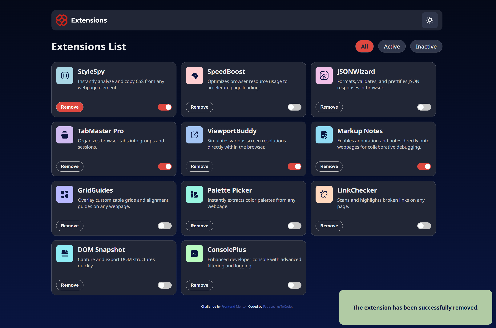

# Frontend Mentor - Browser extensions manager UI solution

This is a solution to the [Browser extensions manager UI challenge on Frontend Mentor](https://www.frontendmentor.io/challenges/browser-extension-manager-ui-yNZnOfsMAp). Frontend Mentor challenges help you improve your coding skills by building realistic projects.

## Table of contents

- [Overview](#overview)
  - [Screenshot](#screenshot)
  - [Links](#links)
- [My process](#my-process)
  - [Built with & Features](#built-with)
  - [What I learned](#what-i-learned)
- [Author](#author)

## Overview

### Screenshot

### Links

- Live Site URL: [Live site URL here](https://fedelearnstocode.github.io/Browser-extensions-manager-UI/)

## My process

### Built with

- Semantic HTML5 markup
- CSS custom properties
- Flexbox
- Mobile-first workflow
- Vanilla JavaScript

### Features

- Toggle extensions between active and inactive states
- Filter active and inactive extensions
- Remove extensions from the list with confirmation toast message
- Select and persist their color theme with `localStorage`
- Responsive layout optimized for different screen sizes
- See hover and focus states for all interactive elements
- ARIA attributes and accessible interactions for screen readers

### What I learned

This project allowed me to deepen my understanding of several key front-end development concepts:

- How to dynamically generate UI elements with vanilla JavaScript using `createElement` and `appendChild`.
- How to fetch and render data from an external `JSON` file.
- How to manage UI state (active/inactive extensions) and apply conditional class toggling to filter items.
- How to implement a dark/light theme toggle and persist the user's preference using `localStorage`.
- How to provide visual feedback through animated toast messages for better user experience.

## Author

- Frontend Mentor - [@FedeLearnsToCode](https://www.frontendmentor.io/profile/FedeLearnsToCode)
